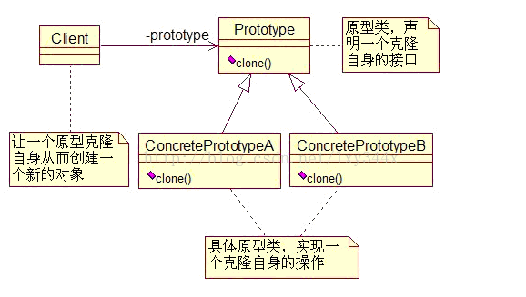
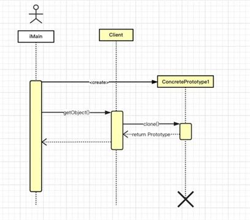

## 创建型模式
### 原型模式

**1、模式定义**：

原型模式(Factory Method Pattern)，用原型实例指向创建对象的种类，并且通过拷贝这些原型创建新的对象。

简单工厂模式包含如下角色:

**Prototype**：原型角色

**ConcretePrototype**：具体原型角色

模式结构：

时序图：

**2、适用场景**：  
- 1、当这些类在运行时被指定初始化，比如，通过动态加载。
- 2、为了避免创建一个与产品类层次相平行的工厂类层次时。
- 3、当一个类的实例能有许多不同状态组合中之一时，创建相应数目的原型并克隆它们比手动实例化它们更方便些。

**3、模式总结**：  

在 Java 中实现原型模式比较简单，因为所有类都显式或隐式继承于 Object 类，而 Object 中又有 clone() 方法用来拷贝对象，但是要注意默认的拷贝方法是浅拷贝，所以需要重写，具体的实现有 clone 和 序列化等方式，实现对应的接口即可。

优点：
- 使用原型模式创建对象比直接new一个对象在性能上要好的多，因为Object类的clone方法是一个本地方法，它直接操作内存中的二进制流，特别是复制大对象时，性能的差别非常明显。
- 使用原型模式的另一个好处是简化对象的创建，使得创建对象就像我们在编辑文档时的复制粘贴一样简单。
- 因为以上优点，所以在需要重复地创建相似对象时可以考虑使用原型模式。比如需要在一个循环体内创建对象，假如对象创建过程比较复杂或者循环次数很多的话，使用原型模式不但可以简化创建过程，而且可以使系统的整体性能提高很多。

缺点：
- 原型模式的主要缺点是每个原型类的子类必须实现 Clone 操作，这可能很困难。
- 实现 Clone 操作可以很困难，当内部包含不支持拷贝或有循环引用的对象时。